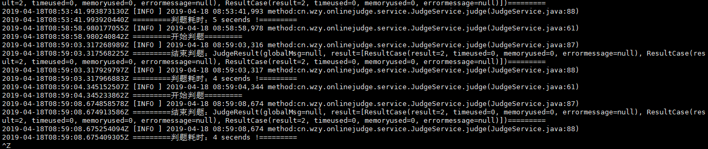

## ACM独立判题服务
## 判题语言支持：
* GCC
    * GNU C90
    * GNU C99
    * GNU C11
* G++
    * GNU C++98
    * GNU C++11
    * GNU C++14
    * GNU C++17
* Java 1.8
* python2.7
* python3.6
* JavaScript
* C#
* Ruby
* GO
## 判题接口
POST http://acm.swust.edu.cn/OnlineJudge/judge.do  
参数列表（json）：
* 输入样例数组
* 输出样例数组
* 时间限制：ms
* 内存限制：kb
* 判题语言：上述语言列表1-14
* 源代码
~~~
{
	"input":["99 1","99 1","99 1"],
	"output":["98","100\n","100"],
	"timeLimit":1000,
	"memoryLimit":65535,
	"judgeId":1,
	"src":"#include<stdio.h>\nint main()\n{\n\tint a,b,sum;\n\tscanf(\"%d %d\",&a,&b);\n\tsum=a+b;\n\tprintf(\"%d\",sum);\n\treturn 0;\n}"
}
~~~
返回数据（json）：
* 全局信息：编译错误信息之类的，判题正常为null
* 判题信息（按参数组数顺序）：
    * 结果：
    * 时间消耗
    * 空间消耗
    * 运行错误信息：运行正常为null
~~~
{
    "globalMsg": null,
    "result": [
        {
            "result": 4,
            "timeused": 0,
            "memoryused": 0,
            "errormessage": null
        },
        {
            "result": 1,
            "timeused": 0,
            "memoryused": 0,
            "errormessage": null
        },
        {
            "result": 0,
            "timeused": 1,
            "memoryused": 6896,
            "errormessage": null
        }
    ]
}
~~~
返回结果集：0 ~ 8
* 'Accepted'
* 'Presentation Error'
* 'Time Limit Exceeded'
* 'Memory Limit Exceeded'
* 'Wrong Answer'
* 'Runtime Error'
* 'Output Limit Exceeded'
* 'Compile Error'
* 'System Error'
## 项目说明
此项目为spring-boot项目，可以直接运行在服务器tomcat里面，各个语言的环境需要自己搭建。但为了判题安全，强烈建议docker中运行。
## 结合docker
为了达到判题安全，让判题运行在沙盒的环境里面，我是采用docker运行判题容器，将容器的tomcat端口（8080）映射到服务器的某个端口上。  
样例：docker run --name oj -p 8888:8080 -d online_judge /start.sh
## 判题镜像下载安装
我已经创建了一个ubuntu的判题镜像，需要的可以下载导入到自己的服务器上运行。  
下载地址：下载地址 :https://pan.baidu.com/s/12Y7wQnkv2WaiR4uNTeaY8Q 提取码: 9rmb  
导入：docker load < online_judge.iso  
运行：docker run --name oj -p 8888:8080 -d online_judge /start.sh  
测试部署：http://ip:8888/OnlineJudge/judge.do  
查看判题日志：sudo docker logs -ft oj

## 高并发下的扩展
docker容器的运行只用一个镜像，那么可以将镜像拷贝到一台新机器上（只用装docker）运行，省去了配置各种环境，增加机器特别快，
再配置一层nginx做一个负载均衡，nginx修改配置文件也是能立马生效的，那么可以达到更高的并发！  