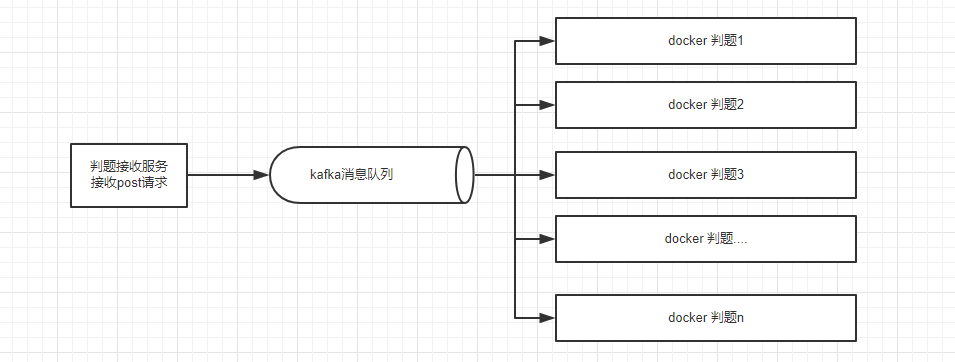

## ACM独立判题服务
开源项目地址：[github](https://github.com/1510460325/online-judge/)  
可针对性的添加判题语言，或者修改判题细节
## 判题语言支持：
* GCC
    * GNU C90
    * GNU C99
    * GNU C11
* G++
    * GNU C++98
    * GNU C++11
    * GNU C++14
    * GNU C++17
* Java 1.8
* python2.7
* python3.6
* JavaScript
* C#
* Ruby
* GO
## 判题接口
POST http://wangzhengyu.cn:8081/producer/judge.do   
参数列表（json）：
* 题目id(题目id为本人数据库指定题目id，指定后测试数据为本人系统提供)
* 输入样例数组（自定义输入样例，输入id之后忽略）
* 输出样例数组（自定义输出样例，输入id之后忽略）
    * "input":["12 12","13 12"] 相当于两个测试用例，第一次测试输入12 12，第二次测试输入13 12
    * "output":["24","25"] 对应上面的输出用例的标准输出，第一次测试输出24，第二次测试输出25
* 时间限制：ms
* 内存限制：kb
* 判题语言：上述语言列表1-14
* 源代码
* callBack地址：为put请求方式的地址
~~~
{
    "proId":15,
	"input":["99 1","99 1","99 1"], // 有多少个测试数据数组就多长
	"output":["98","100\n","100"],  // 对应上面每个输入的标准输出
	"timeLimit":1000,
	"memoryLimit":65535,
	"judgeId":1,
	"src":"#include<stdio.h>\nint main()\n{\n\tint a,b,sum;\n\tscanf(\"%d %d\",&a,&b);\n\tsum=a+b;\n\tprintf(\"%d\",sum);\n\treturn 0;\n}",
	"callBack" :"http://ip:port/demo/update.do?submitId=111"
}
~~~
判题采用异步回调更新函数，网站服务器将判题任务和该id提交给判题服务器，判题服务器判题结束自动调用回调函数携带判题结果。  
如上述任务会将结果返回到callBack的put接口中，网站服务器只需要指定一个PUT类型回调地址即可，参数submitId为了分辨是哪个任务的回调结果。  
为了回调接口安全，防止其他人篡改结果，建议外加一个密钥："callBack" :"http://ip:port/demo/update.do?submitId=111&key=1asdf112asdfasdf",
由于这个接口地址由网站服务器指定之后发送给判题服务器的，所以只有这两个服务器知道密钥，所以其他人不能修改结果。  
回调接口样例：https://github.com/1510460325/online-judge/blob/master/producer/src/main/java/cn/wzy/producer/controller/JudgeController.java  
返回数据（json）：
* 全局信息：编译错误信息之类的，判题正常为null
* 判题信息（按参数组数顺序）：
    * 结果：
    * 时间消耗
    * 空间消耗
    * 运行错误信息：运行正常为null
~~~
{
    "globalMsg": null,
    "result": [
        {
            "result": 4,
            "timeused": 0,
            "memoryused": 0,
            "errormessage": null
        },
        {
            "result": 1,
            "timeused": 0,
            "memoryused": 0,
            "errormessage": null
        },
        {
            "result": 0,
            "timeused": 1,
            "memoryused": 6896,
            "errormessage": null
        }
    ]
}
~~~
返回结果集：0 ~ 8
* 'Accepted'
* 'Presentation Error'
* 'Time Limit Exceeded'
* 'Memory Limit Exceeded'
* 'Wrong Answer'
* 'Runtime Error'
* 'Output Limit Exceeded'
* 'Compile Error'
* 'System Error'
## 项目整体架构
* 一个判题接收服务：运行在真实服务器上
* kafka消息队列：保存判题任务，让下游服务消费
* docker虚拟服务：运行判题服务消费判题任务,多台负载均衡

## 打包
原本想将项目打包成一个镜像的，但是考虑到kafka的配置，打包成一个镜像实在有些牵强，还是自己配置方便得多。

## 源码说明及个人搭建教程
### 1.源码结构
* producer：接受外部的POST接口请求，发送到kafka消息对列
* consumer：消费kafka任务，判题后将结果回调到callback中
### 2.运行环境(linux 环境)
* kakfa：用于producer和consumer之间的通信
    * 安装教程：略
### 3.搭建教程
* clone 此项目
* 修改配置文件
    * kafka的地址：spring.kafka.bootstrap-servers=192.168.0.115:9092
    * 判题程序编译：用于测试用户时间和内存消耗，是c语言写的，需要编译一下  
    命令：g++ judge.c -o judge
    * 修改判题文件配置：judge.scriptPath=/home/hadoop/judge/test/judge
* 打包：mvn clean package -DskipTests
* 启动项目：
    * java -jar consumer-0.0.1-SNAPSHOT.jar &
    * java -jar producer-0.0.1-SNAPSHOT.jar &
* 测试：
~~~
1.PostMan 测试接口：POST http://你的IP:8081/producer/judge.do 
数据为JSON格式，body如下：
{
    "proId":15,
	"input":["99 1","99 1","99 1"], // 有多少个测试数据数组就多长
	"output":["98","100\n","100"],  // 对应上面每个输入的标准输出
	"timeLimit":1000,
	"memoryLimit":65535,
	"judgeId":1,
	"src":"#include<stdio.h>\nint main()\n{\n\tint a,b,sum;\n\tscanf(\"%d %d\",&a,&b);\n\tsum=a+b;\n\tprintf(\"%d\",sum);\n\treturn 0;\n}",
	"callBack" :"http://你的IP:8081/producer/result.do"
}
2.检查返回数据为OK
3.查看判题回调result接口里面会有日志输出
2019-09-29 22:02:49  [ http-nio-8081-exec-9:3730277313 ] - [ INFO ]  
************
	收到任务,将回调到:http://wangzhengyu.cn:8081/producer/result.do?key=111&submitId=12
************
2019-09-29 22:02:52  [ http-nio-8081-exec-1:3730279390 ] - [ INFO ]  
*****************
	key: 111
	submitId: 12
	result: JudgeResult(globalMsg=timeOut, result=null)
*****************
~~~
***如果此项目对您有帮助，希望能给个star！***  
***如果有爱心人士能给个红包买瓶快乐肥宅水喝也是对我这个小可爱最大的鼓励哟***  
</img>
</img>